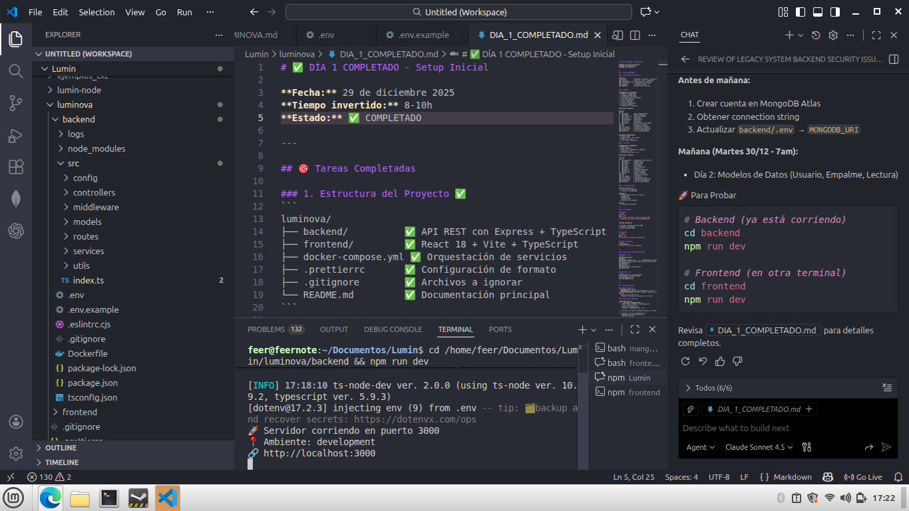
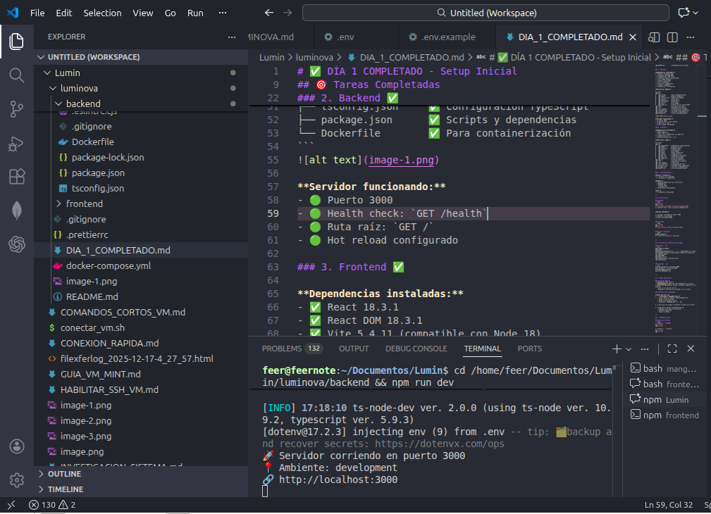
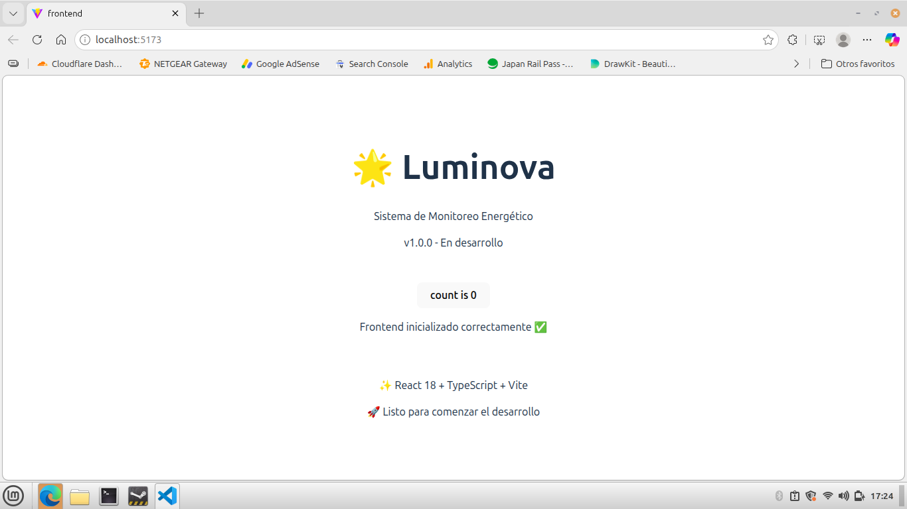

# ✅ DÍA 1 COMPLETADO - Setup Inicial

**Fecha:** 29 de diciembre 2025  
**Tiempo invertido:** 8-10h  
**Estado:** ✅ COMPLETADO

---

## 🎯 Tareas Completadas

### 1. Estructura del Proyecto ✅
```
luminova/
├── backend/          ✅ API REST con Express + TypeScript
├── frontend/         ✅ React 18 + Vite + TypeScript
├── docker-compose.yml ✅ Orquestación de servicios
├── .prettierrc       ✅ Configuración de formato
├── .gitignore        ✅ Archivos a ignorar
└── README.md         ✅ Documentación principal
```

### 2. Backend ✅

**Dependencias instaladas:**
- ✅ express (servidor web)
- ✅ mongoose (MongoDB ODM)
- ✅ jsonwebtoken (JWT auth)
- ✅ bcryptjs (hash de contraseñas)
- ✅ cors (CORS headers)
- ✅ helmet (seguridad)
- ✅ joi (validación)
- ✅ socket.io (WebSockets)
- ✅ winston (logging)
- ✅ TypeScript + ts-node-dev

**Estructura creada:**
```
backend/
├── src/
│   ├── config/       (para configuraciones)
│   ├── models/       (modelos Mongoose)
│   ├── controllers/  (lógica de negocio)
│   ├── routes/       (rutas API)
│   ├── middleware/   (middlewares)
│   ├── services/     (servicios)
│   ├── utils/        (utilidades)
│   └── index.ts      ✅ Server básico funcionando
├── logs/             (directorio de logs)
├── .env              ✅ Variables de entorno
├── .env.example      ✅ Plantilla de variables
├── tsconfig.json     ✅ Configuración TypeScript
├── package.json      ✅ Scripts y dependencias
└── Dockerfile        ✅ Para containerización
```


**Servidor funcionando:**
- 🟢 Puerto 3000
- 🟢 Health check: `GET /health`
- 🟢 Ruta raíz: `GET /`
- 🟢 Hot reload configurado




### 3. Frontend ✅

**Dependencias instaladas:**
- ✅ React 18.3.1
- ✅ React DOM 18.3.1
- ✅ Vite 5.4.11 (compatible con Node 18)
- ✅ TypeScript 5.5.3
- ✅ @vitejs/plugin-react 4.3.4



**Estructura creada:**
```
frontend/
├── src/
│   ├── components/   (componentes reutilizables)
│   ├── pages/        (páginas/vistas)
│   ├── services/     (llamadas API)
│   ├── hooks/        (custom hooks)
│   ├── utils/        (utilidades)
│   ├── types/        (tipos TypeScript)
│   ├── assets/       (imágenes, etc)
│   ├── App.tsx       ✅ Componente principal
│   ├── main.tsx      ✅ Punto de entrada
│   └── index.css     ✅ Estilos globales
├── public/           (archivos estáticos)
├── .env              ✅ Variables de entorno
├── .env.example      ✅ Plantilla
├── vite.config.ts    ✅ Configuración Vite
├── tsconfig.json     ✅ Configuración TypeScript
├── package.json      ✅ Scripts y dependencias
└── Dockerfile        ✅ Para containerización
```

### 4. Configuraciones ✅

**ESLint & Prettier:**
- ✅ .eslintrc.cjs (backend)
- ✅ .prettierrc (compartido)

**Docker:**
- ✅ docker-compose.yml con 3 servicios:
  - MongoDB 7.0
  - Backend Node
  - Frontend Vite
- ✅ Dockerfiles individuales

**Git:**
- ✅ .gitignore configurado

---

## 🧪 Verificación

### Backend
```bash
cd backend
npm run dev
# ✅ Servidor corriendo en http://localhost:3000
# ✅ Health check: http://localhost:3000/health
```

**Salida esperada:**
```
🚀 Servidor corriendo en puerto 3000
📍 Ambiente: development
🔗 http://localhost:3000
```

### Frontend
```bash
cd frontend
npm run dev
# ✅ Dev server en http://localhost:5173
```

### Docker (opcional)
```bash
docker-compose up
# ✅ Todos los servicios levantados
```

---

## 📝 Archivos de Configuración Creados

### Backend `.env`
```env
NODE_ENV=development
PORT=3000
MONGODB_URI=mongodb+srv://...  # ⚠️ ACTUALIZAR con tu URI
JWT_SECRET=tu-secreto-super-seguro-cambiar-en-produccion
JWT_EXPIRES_IN=7d
UDP_PORT=5000
UDP_HOST=0.0.0.0
CORS_ORIGIN=http://localhost:5173
LOG_LEVEL=debug
```

### Frontend `.env`
```env
VITE_API_URL=http://localhost:3000
VITE_WS_URL=ws://localhost:3000
VITE_APP_NAME=Luminova
VITE_APP_VERSION=1.0.0
```

---

## ⚠️ Notas Importantes

### Versiones Node.js
- **Tienes:** Node 18.19.1
- **Recomendado:** Node 20+ (para Mongoose 9 y Joi 18)
- **Solución aplicada:** Usamos versiones compatibles con Node 18
  - Vite 5.4.11 (en vez de 7+)
  - Mongoose 9 funciona con warnings (no críticos)

### Próximos Pasos Sugeridos

**Antes del Día 2:**
1. ⚠️ **Configurar MongoDB Atlas:**
   - Crear cuenta en https://cloud.mongodb.com
   - Crear cluster gratuito
   - Obtener connection string
   - Actualizar `MONGODB_URI` en `.env`

2. ✅ Verificar que ambos servidores arrancan sin errores

3. 📚 Opcional: Revisar documentación de:
   - Mongoose Time Series Collections
   - JWT Best Practices
   - Socket.io Rooms

---

## 🚀 Comandos Útiles

### Desarrollo Normal
```bash
# Terminal 1 - Backend
cd backend
npm run dev

# Terminal 2 - Frontend  
cd frontend
npm run dev
```

### Con Docker
```bash
# Levantar todos los servicios
docker-compose up

# Levantar en background
docker-compose up -d

# Ver logs
docker-compose logs -f

# Detener
docker-compose down
```

### Linting
```bash
# Backend
cd backend
npm run lint

# Frontend (cuando se configure)
cd frontend
npm run lint
```

---

## 📊 Progreso del Roadmap

**Semana 1: Fundamentos**
- ✅ Día 1: Setup Inicial (COMPLETADO)
- ⏳ Día 2: Modelos de Datos
- 🚫 Día 3: No disponible (31 dic)
- 🚫 Día 4: No disponible (1 ene)
- ⏳ Día 5: Autenticación JWT
- ⏳ Día 6: API REST Core
- ⏳ Día 7: Importador Legacy

**Tiempo estimado:** 5% del proyecto completado

---

## 🎉 Logros del Día

1. ✅ Proyecto base completamente configurado
2. ✅ Backend Express + TypeScript funcionando
3. ✅ Frontend React + Vite funcionando
4. ✅ Docker Compose listo
5. ✅ Estructura de directorios profesional
6. ✅ Configuraciones de desarrollo
7. ✅ Variables de entorno configuradas

---

## 🔜 Siguiente: Día 2 - Modelos de Datos

**Martes 30/12 - 8-10h**

Tareas:
- Diseñar esquemas Mongoose (Usuario, Empalme, Dispositivo, Lectura)
- Implementar modelos con TypeScript
- Configurar Time Series Collection
- Crear índices optimizados
- Seeders para datos de prueba

---

**Estado final:** ✅ DÍA 1 COMPLETADO  
**Próximo día laborable:** Martes 30/12 a las 7:00am  
**Café:** ☕ Recomendado para mañana
